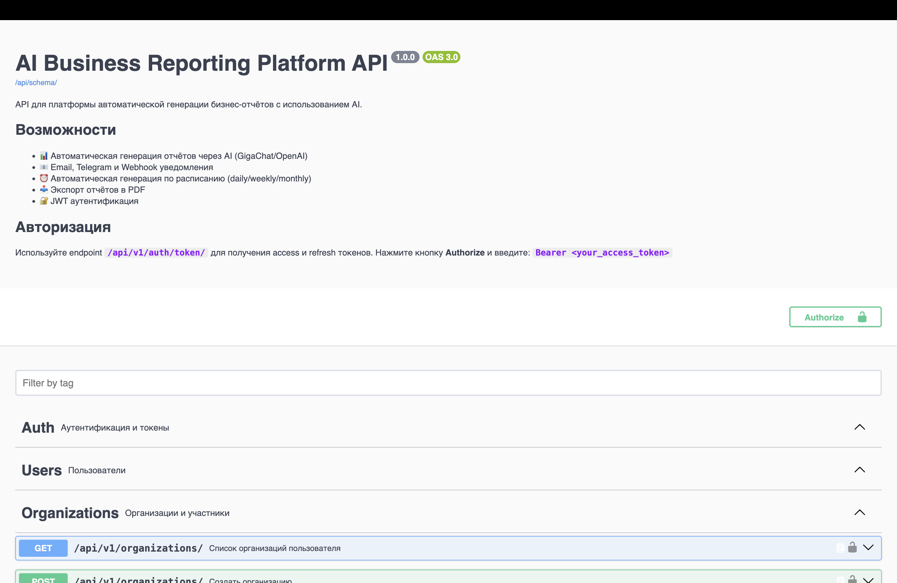
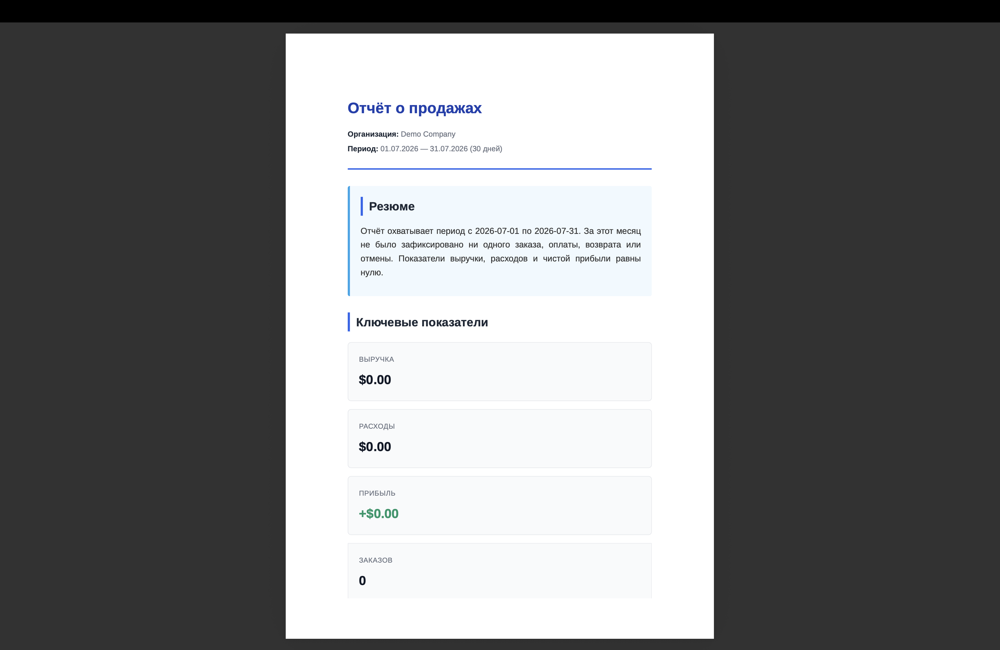
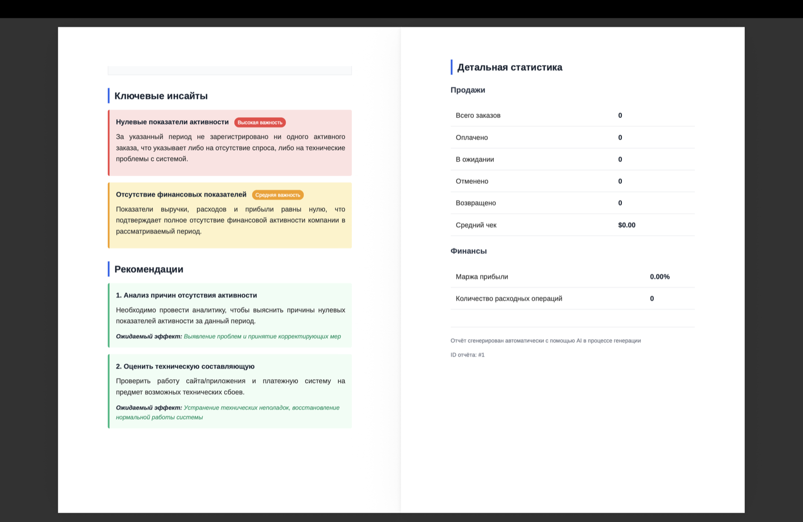
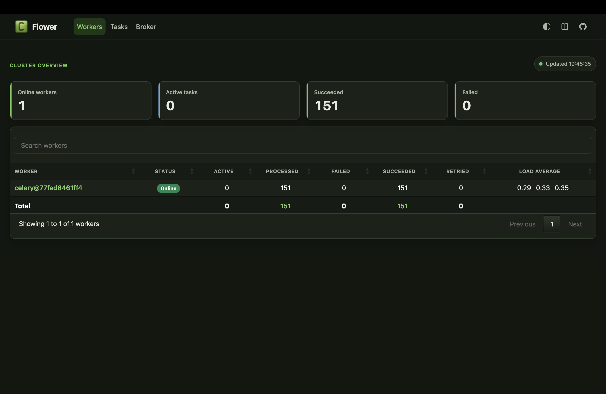

# 🤖 AI Business Reporting Platform

[](https://python.org)
[](https://djangoproject.com)
[](https://fastapi.tiangolo.com)
[](https://docker.com)
[](#)
[](LICENSE)

> **AI-powered платформа для автоматической генерации бизнес-отчётов**
> Анализирует продажи, расходы и финансы, создаёт PDF-отчёты с инсайтами и отправляет уведомления через Email/Telegram/Webhook.

## ✨ Возможности

- 🤖 **AI-генерация отчётов** через GigaChat / OpenAI / Fake provider
- 📊 **Автоматические метрики** — продажи, финансы, топ-категории расходов
- 📥 **PDF экспорт** с красивым оформлением (WeasyPrint + русский язык)
- ⏰ **Расписания** — daily/weekly/monthly автогенерация через Celery Beat
- 📧 **Мультиканальные уведомления** — Email (SMTP), Telegram, Webhook
- 🔐 **Role-based access** — owner / admin / member с разными правами
- 📈 **Мониторинг задач** через Flower
- 🚀 **Production-ready** — Docker Compose, Nginx, Gunicorn
- 📚 **OpenAPI документация** — Swagger UI из коробки
- 🛡️ **Безопасность** — JWT auth, rate limiting, CORS, XSS/SQL protection

## 🏗️ Архитектура

```
                          ┌──────────────────────────┐
         Client ────────► │   Nginx (reverse proxy)  │
         (Browser/API)    │      port 80             │
                          └───────┬─────────┬────────┘
                                  │         │
                   ┌──────────────┘         └──────────────┐
                   ▼                                        ▼
           ┌───────────────┐                    ┌──────────────────────┐
           │  Django API   │                    │ FastAPI Notification │
           │  (Gunicorn)   │───── Celery ──────►│     Service          │
           │  port 8000    │     Task Queue     │   (email/telegram)   │
           └───────┬───────┘                    └──────────────────────┘
                   │                                          ▲
        ┌──────────┼──────────┐                               │
        ▼          ▼          ▼                               │
   ┌─────────┐ ┌────────┐ ┌────────┐               ┌─────────────────┐
   │PostgreSQL│ │ Redis  │ │Celery  │               │   AI Provider   │
   │  (data)  │ │(broker)│ │ Worker │──── AI API ──►│ GigaChat/OpenAI │
   └─────────┘ └────────┘ │  Beat  │               └─────────────────┘
                          │ Flower │
                          └────────┘
```

**8 сервисов** запускаются одной командой `docker compose up`.

## 🛠️ Стек технологий

### Backend
- **Django 5.2** + **Django REST Framework** — REST API
- **FastAPI** — микросервис уведомлений
- **PostgreSQL 16** — основная БД
- **Redis 7** — broker для Celery + cache
- **Celery + Celery Beat** — асинхронные задачи и расписания
- **GigaChat / OpenAI** — AI-генерация текста
- **WeasyPrint** — генерация PDF с поддержкой кириллицы

### DevOps
- **Docker + Docker Compose** — контейнеризация
- **Nginx** — reverse proxy
- **Gunicorn** — production WSGI server
- **Flower** — мониторинг Celery задач

### Quality
- **pytest + pytest-django** — 166 тестов
- **drf-spectacular** — OpenAPI 3.0 / Swagger UI
- **ruff + black** — линтинг и форматирование
- **JWT** — stateless аутентификация

## ⚡ Быстрый старт (Docker)

### Требования
- Docker 24+
- Docker Compose 2+
- ~2 GB свободного места

### 1. Клонируй и настрой

```bash
git clone https://github.com/your-username/ai-business-reporting-platform.git
cd ai-business-reporting-platform
cp .env.example .env
# Отредактируй .env — добавь AI_API_KEY для GigaChat
```

### 2. Запусти всё одной командой

```bash
docker compose up -d --build
```

Подожди 1-2 минуты, пока все сервисы стартуют.

### 3. Создай суперпользователя

```bash
docker compose exec api python manage.py createsuperuser
```

### 4. Открой в браузере

- 📚 **Swagger UI**: http://localhost/api/docs/
- 🔧 **Django Admin**: http://localhost/admin/
- 📊 **Flower** (Celery): http://localhost:5555
- ❤️ **Health check**: http://localhost/api/v1/health/

## 📚 Примеры API

### Получить токен

```bash
curl -X POST http://localhost/api/v1/auth/token/ \
  -H "Content-Type: application/json" \
  -d '{"email": "admin@example.com", "password": "admin123456"}'
```

### Создать организацию

```bash
curl -X POST http://localhost/api/v1/organizations/ \
  -H "Authorization: Bearer $TOKEN" \
  -H "Content-Type: application/json" \
  -d '{"name": "My Company"}'
```

### Сгенерировать отчёт

```bash
curl -X POST http://localhost/api/v1/reports/generate/ \
  -H "Authorization: Bearer $TOKEN" \
  -H "Content-Type: application/json" \
  -d '{
    "organization_id": 1,
    "report_type": "sales",
    "period_start": "2026-07-01T00:00:00Z",
    "period_end": "2026-07-31T23:59:59Z"
  }'
```

### Создать расписание (ежедневный отчёт в 9:00)

```bash
curl -X POST http://localhost/api/v1/organizations/1/schedules/ \
  -H "Authorization: Bearer $TOKEN" \
  -H "Content-Type: application/json" \
  -d '{
    "report_type": "sales",
    "frequency": "daily",
    "run_at_hour": 9,
    "run_at_minute": 0,
    "is_active": true
  }'
```

## 🔧 Локальная разработка (без Docker)

```bash
cd backend
python -m venv .venv
source .venv/bin/activate  # Windows: .venv\Scripts\activate

pip install -r requirements/base.txt
pip install -r requirements/dev.txt

# Запусти PostgreSQL и Redis локально
# Затем:
python manage.py migrate
python manage.py runserver

# В другом терминале — Celery worker:
celery -A config worker --loglevel=info

# В третьем — Celery Beat:
celery -A config beat --loglevel=info
```

Для notification-service:

```bash
cd notification-service
python -m venv .venv
source .venv/bin/activate
pip install -r requirements.txt
uvicorn app.main:app --reload --port 8001
```

## 🧪 Тестирование

```bash
cd backend
pytest -v
pytest --cov=. --cov-report=html
```

Покрытие тестами: **166 тестов** покрывают auth, organizations, reports, Celery задачи, security.

## 📝 Переменные окружения

См. `.env.example` для полного списка. Ключевые:

| Переменная | Описание |
|-----------|----------|
| `DJANGO_SECRET_KEY` | Секретный ключ Django |
| `POSTGRES_*` | Настройки PostgreSQL |
| `AI_PROVIDER` | `gigachat` / `openai` / `fake` |
| `AI_API_KEY` | Ключ для AI провайдера |
| `SMTP_*` | Настройки email |
| `TELEGRAM_BOT_TOKEN` | Telegram бот для уведомлений |

## 📸 Скриншоты

### Swagger UI


### Сгенерированный PDF отчёт



### Flower — мониторинг Celery


## 🚢 Production деплой

```bash
# Настрой HTTPS через LetsEncrypt
# Измени ALLOWED_HOSTS на свой домен
# Используй SECURE_SSL_REDIRECT=true
docker compose -f docker-compose.yml -f docker-compose.prod.yml up -d
```

Рекомендуется:
- Отдельный PostgreSQL instance (AWS RDS / managed DB)
- Redis через managed service
- SMTP через SendGrid/Mailgun
- Monitoring через Sentry + Prometheus

## 🛣️ Roadmap

- [ ] Сравнение периодов (month-over-month)
- [ ] Графики и визуализация в отчётах
- [ ] Экспорт в Excel
- [ ] Поддержка нескольких AI провайдеров
- [ ] Feedback на отчёты (like/dislike)
- [ ] Prometheus + Grafana метрики
- [ ] CI/CD pipeline (GitHub Actions)
- [ ] Сделать front-end

## 🤝 Contributing

Pull requests приветствуются! Для крупных изменений откройте issue сначала.

## 📄 Лицензия

MIT License — см. [LICENSE](LICENSE)

---

<div align="center">

[Report Bug](https://github.com/holomolo4884/ai-business-reporting-platform/issues) · [Request Feature](https://github.com/holomolo4884/ai-business-reporting-platform/issues)

</div>
